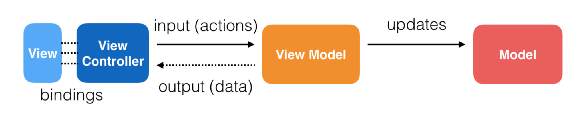

# MVVM-Rx

An iOS sample project showcasing 2 structured reactive programming approaches using ReactiveX.



## Background
* A ViewModel...
  * takes a central role in the architecture: It takes care of the business logic and talks to both the model and the view.
  * should follow a clear Input -> Output pattern for proper testing of predefined inputs and expected outputs
  * should be pluggable to any View (remember: View does not stand for ViewController)
  * is completely separated from the presentation layer and, when necessary, can be re-used between platforms
* it is not the way a View is built that is going to define the public contract of a ViewModel
* it’s the View that owns the ViewModel, meaning; the View is aware of the ViewModel, not the other way around

## Rx Contracts

``` swift

protocol ReactiveConnectable {
    associatedtype Input
    associatedtype Output
}

protocol ReactiveTransformable: ReactiveConnectable {
    associatedtype Input
    associatedtype Output

    func transform(input: Input) -> Output
}

protocol ReactiveFeedable: ReactiveConnectable {
    associatedtype Input
    associatedtype Output

    var input: Input { get }
    var output: Output { get }
}

``` 


## Approaches

### ReactiveTransformable: 
* define an Input and Output struct
* the `viewModel` defines a transformation method to transform the View inputs to observable outputs
* no subjects, only observables / related traits
* the transformation happens once for a certain view type, where all outputs are bound

### ReactiveFeedable
* define an Input and Output struct
* the `viewModel` holds stored Input and Output properties for continuous data feeding
* each Input property has a related subject
* all subjects are **private**
* subjects expose so called `observers` as input references for public access `asObserver()`
